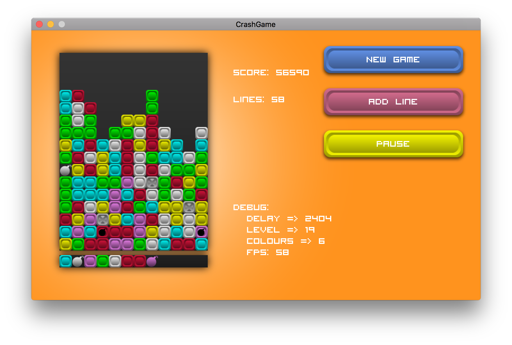

# crash-game

[](https://code.dlang.org/packages/crash-game)

A clone of an arcade game I enjoyed playing when I was a kid.



This is actually a D port of the original C# code I wrote (never published it
though) where I tried out [Xamarin][] and [MonoGame][].  Both frameworks are
really nice to work with, but I've been wanting to try out a completely new
programming language as well (side-note: while looking for new languages I
preferred compiled languages over interpreted ones since I already do a lot of
[Ruby][], which is still my main love ❤️).  After a long time of searching, it
looks like I finally found a match: [D][].
Oh, and porting the code took about three days.

Anyway, here's instructions on how to build (and run) it:

## Requirements

* DMD 2
* DUB
* sdl2, sdl2_image, sdl2_ttf, sdl2_mixer

On macOS you can install these dependencies using homebrew:

``` sh
brew install dmd dub sdl2 sdl2_image sdl2_ttf sdl2_mixer
```

## Building

Building is easy.

``` sh
dub build
```

This should generate a `./crash-game` executable in the repo root.  Run it!

## Bugs

Yes.

[Xamarin]: https://www.xamarin.com/
[MonoGame]: http://www.monogame.net/
[Ruby]: https://ruby-lang.org
[D]: https://dlang.org
